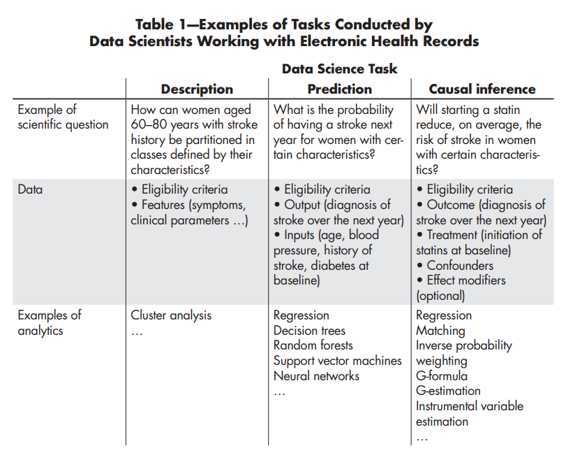

  

*Source: [A Second Chance to Get
Causal Inference Right:
A Classification of Data
Science Tasks](https://content.sph.harvard.edu/wwwhsph/sites/1268/2019/04/hernan_chance19.pdf)*

# Traditional vs Causal Analytics

 <!-- Update the license badge as needed -->

Capstone research project for my M.Sc. in Data Analytics

The full research project report as submitted to my college is included [Here](Thesis_Milo_Moran.pdf)

---

## Table of Contents

- [Description](#description)
- [Methodology](#methodology)
- [Technologies](#technologies)
- [Installation](#installation)
- [Usage](#usage)
- [Acknowledgments](#acknowledgments)

---

## Description

My project  was motivated largely by [This Article](https://content.sph.harvard.edu/wwwhsph/sites/1268/2019/04/hernan_chance19.pdf), and investigates the intersection and divergence of causal inference and traditional(descriptive, predictive) analytics using a dataset of student grades and background information.
The goal was to determine whether causal inference methods could complement traditional predictive analytics by providing deeper insights into
the relationships between features (e.g., study habits, family background) and student performance outcomes.

- **Potential use cases:**
  - Educational Institutions: Schools or universities could use this approach to identify actionable factors (e.g., study habits, parental education) that influence student performance and design targeted interventions.
  - Policy Making: Policymakers could leverage causal insights to allocate resources more effectively, such as funding for tutoring programs or parental support initiatives.
  - Data Science Teams: The methodology could be applied to other domains (e.g., healthcare, marketing) to uncover causal relationships and improve decision-making.

- **Limitations**  
  - Dataset was relatively small (145 observations) and lacked granularity, which limited the robustness of the causal inferences.
  - The causal graph relied on a lot of assumptions that may not fully capture the complexity of real-world relationships, potentially introducing bias.
  - Findings are specific to the dataset and may not generalize to other contexts without further validation.

- **Future features**
  - Expanding the analysis to larger datasets with more features and observations would improve the reliability of the results.
  - Testing the methodology in other domains (e.g., healthcare, finance, sports) to validate its broader applicability.
  - Incorporating more sophisticated causal inference techniques (e.g., instrumental variables, difference-in-differences) could strengthen the analysis.
  - Treatment of variables could be reviewed to increase validity
---
 
 ## Methodology
  - I explored the data extensively using statistical testing and visualisations, to measure correlations with the dependent variable and understand distributions of features respectively.
  - I performed sensitivity analysis to remove features unlikely to contribute to models or have causal effects, and then heavily engineered the remaining features to ensure they could be used for machine learning and interpreted.
  - I ran three different classifier models to predict student grades(DT, SVM, XGBoost), and tuned the models to incease accuracy
  - I used feature importance metrics to determine which features had the biggest influence on the models.
  - I created a DAG to describe any potential causal relationships I would expect between features.
  - I measured
I looked at what information about the students might have caused the grades
I tried to describe what caused what among all the different things I knew about the students
I measured how much changes in different things among the students made their grades change 
I found what matters the most when it comes to what might make the students grades change
I then looked at what I had measured to see if the same things that help predict student grades are the same things that make students have those grades
I found that the information that caused things was different from the information that predicted things
I showed that different features are highlighted as being important via the different kinds of analysis, 
---

## Technologies

The project uses the following technologies:

- Python
- Pandas
- NumPy
- Scikit-learn
- DoWhy
- scipy
- Jupyter Notebook
- bayes_opt

---
## Repository Contents

- Students.ipynb - Exploratory data analysis, statistical testing, sensitivity analysis, rebinning, feature engineering, decision tree classifier, SVM classifier, XGBoost classifier, hyperparameter tuning, feature importance metric production.
- Causal inference for features.ipynb - Feature engineering, DAG initialisation, ATE measurement, statistical comparison using Kruskal wallace tests
- Thesis_Milo_Moran.pdf - The final research project submisssion I made to my college 
- ResearchProposalMiloMoran (1).docx - Initial proposal I submitted as part of my Research and Professional Ethics module
- Keeping track of feature analysis.docx - A document I updated when I was changing feature interpretations to ensure interpretability of the final models
- Appendix doc A.docx - an appendix containing valuable information for interpretability.
- README.md - This wonderful readme file
- hernan_hsu_healy.png - Image for use in the README
- LICENSE - MIT license
